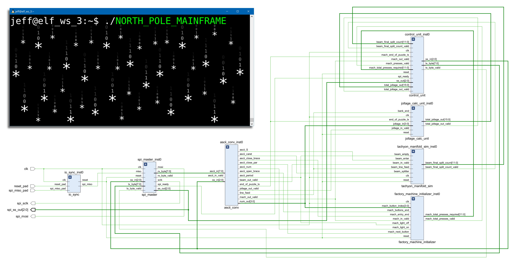

# ADVENT OF FPGA 2025
Advent of FPGA is an FPGA design challenge run by Jane Street Capital, which coincides with the annual Advent of Code challenge.  
Advent of FPGA asks participants to implement any Advent of Code puzzles that they choose in RTL code targetting FPGAs.  
This project implements three Advent of Code puzzles in a single FPGA design, written in Verilog.  
View puzzle descriptions here: [adventofcode.com/2025](https://adventofcode.com/2025)  
View Advent of FPGA blog post from Jane Street: [Advent of FPGA — A Jane Street Challenge](https://blog.janestreet.com/advent-of-fpga-challenge-2025/)

# How-To Simulate
1. Copy the north_pole_mainframe directory onto your device.
2. Set current working directory to this location.
3. Compile with all .v and .vh files, using your favorite simulator (top module is tb.v for testbench, top.v for synthesis).
4. Run sim, and results will be output in the terminal.

# General
## Assumptions
* Input data contains no errors.
* There are no data integrity errors possible internal and external of the FPGA.
* Puzzle input file has to be transmitted from an external device to the FPGA, in its original ASCII format. (ie. no pre-conversion to other data types before transmit to the FPGA)
* External SPI Slave devices require one SPI clock cycle of Slave Select high before another byte can be read (in order to simplify simulation since specific SPI devices were not chosen).
* Puzzle cores are only required to run once, report their output to their corresponding SPI slave, then never function again until Power On/Reset

## Jane Street Constraints
The following are all of the constraints (which the design satisfies) outlined by the Advent of FPGA blog post from Jane Street:
* The design must have realistic I/O usage.
* The RTL must be synthesizable.
* The design must have realistic resource usage.
* The design must be my original work, with no AI usage.

## Design
Solves three puzzles, treating each puzzle input as coming from a dedicated SPI slave device external to the FPGA. The FPGA is the SPI Master, and there are three slave chips which are simulated as part of the testbench. The FPGA design's core blocks are the SPI Master, Control Unit, and a module for each puzzle. SPI Clock Ratio = 10, clk = 250 MHz, sclk = 25 MHz  
Puzzles are solved one at a time, with the control unit initiating SPI transactions to start a puzzle then report the puzzle's final output when complete.  
The puzzles are solved in the following order:  
1. Day 3, Part 1
2. Day 7, Part 1
3. Day 10, Part 1

The general dataflow of the design is as follows (refer to schematic at top of README for more detail):  
MISO input to FPGA → io_sync → spi_master → ascii_conv → joltage_calc_unit or tachyon_manifold_sim or factory_machine_initializer (depending on active puzzle) → puzzle output to control_unit → control_unit sends puzzle output to spi_master → spi_master transmits puzzle output to appropriate SPI slave through MOSI output

## Testbench
Each puzzle result is verified by comparing the design's result with the answer that was obtained via the Advent of Code website, for my specific puzzle input data. (ie. the hard-coded expect-values and various parameters/hard-coded values in design and testbench files will need to be changed if the user would like to test other input files.) The total simulation time should be about 23 ms.

# Day 3, Part 1 (joltage_calc_unit.v)
## Assumptions
* Input data contains no joltage of zero values.

## Design
As the input file data is read in from an SPI slave, the module uses the following algorithm to find the largest joltage value per bank:
1. Initially read in first two joltage values and set as current max joltage.
2. On next joltage value read in (pseudocode):  
  ```cpp
  if(current_joltage_tens_digit < current_joltage_ones_digit) {  
    current_joltage_tens_digit = current_joltage_ones_digit;  
    current_joltage_ones_digit = new_joltage_in;  
  }  
  else if(current_joltage_ones_digit < new_joltage_in) {  
    current_joltage_ones_digit = new_joltage_in;  
  }
  ```
4. Repeat step 2 until bank end hit.
5. Add max joltage for bank to running sum of bank joltages.
6. SPI slave sends End of Transmission character (0x04) after the final character of the input file to signal that the total joltage output should be sent from the master.

# Day 7, Part 1 (tachyon_manifold_sim.v)
## Assumptions
* The beam splitters are always increasing in width as they go down the length of the taychon manifold.
* A beam splitter is never next to another beam splitter in a line.
* The taychon manifold ends when beams are at the min and/or max x-coordinates.
* The lines of the input file always alternate between line with beam splitters then line with no beam splitters.

## Design
The beams are kept in an x-coordinate vector that keeps track of the previous line's beam positions. When a splitter is hit, this vector is updated with new beam coordinates and the split count is incremented. Once the end of a line is hit, repeat above process by using previous line beam vector. Once the max y-coordinate is hit, the total # of splits is reported to the SPI slave.

# Day 10, Part 1 (factory_machine_initializer.v)
## Assumptions
* Machines have no duplicate buttons.
* Machines always have at least one button combination that results in correct light output.

## Design
Reads in and stores the input file data, sent from an SPI slave. Contains a paramaterized # of cores that each machine's data is dispatched to. Each core is capable of finding all possible button combinations using simple binary counting, and the light output of a button combination is computed using XOR operations. Each core is monitored to detect when a core is ready for new data and when a machine's least # of presses has been calculated. The sum of the least presses across all machines is reported to the SPI slave. Buttons/Lights values memory is inferred as RAM. Can be synthesized to BRAM and/or distributed RAM, based on which would yield higher performance.

## Known Issues
The CORE_COUNT parameter was originally intended to be used to increase the # of combo_solver_cores to gain performance via parallel computation. However, a single core can finish a computation faster than it takes to read in the next machine (based on my specific input file). Therefore, increasing the core count does not further increase throughput, it only increases utilization. I've still kept the count at 2 in order to see the function of multi cores (see in waveforms). For input files with a higher max button count per machine, and with back-to-back machines with this higher max button count, multiple cores could increase performance. This is because with each button, the # of possible button combinations increases by a factor of 2. While there are only a few more bytes to read in for this extra button.
